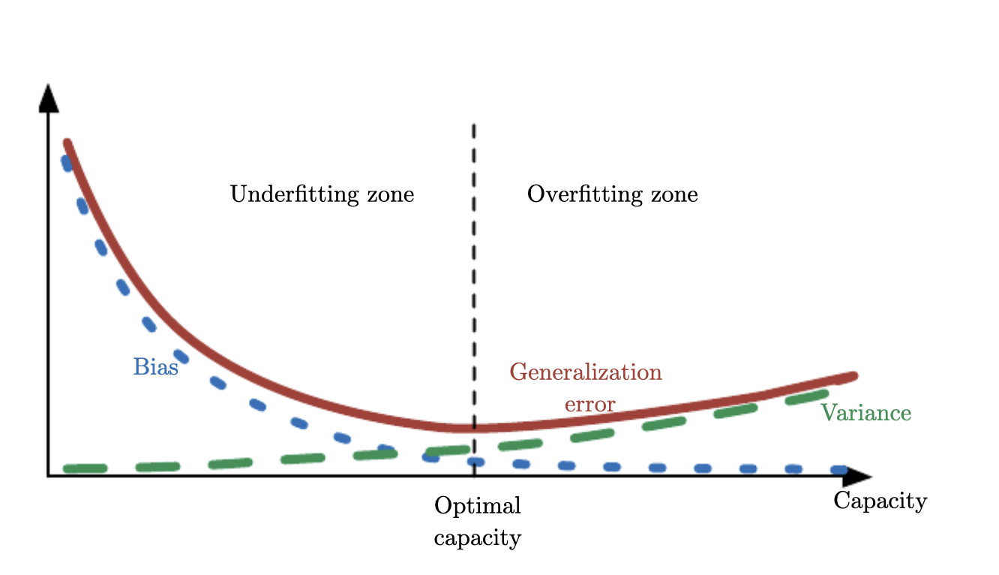

```{r setup, include=FALSE}
options(htmltools.dir.version = FALSE)
knitr::opts_chunk$set(
  fig.width=9, fig.height=3.5, fig.retina=3,
  out.width = "100%",
  cache = FALSE,
  echo = TRUE,
  message = FALSE, 
  warning = FALSE,
  hiline = TRUE
)
library(xaringanthemer)

library(showtext)
## Loading Google fonts (https://fonts.google.com/)
font_add_google("Lato", "lato")
font_add_google("Lora", "lora")

## Automatically use showtext to render text
showtext_auto()

```

```{r xaringan-themer, include=FALSE, warning=FALSE}
color_vec <- c("#38444c")
style_mono_accent(
  base_color = color_vec[1],
  header_font_google = google_font("Lato"),
  text_font_google   = google_font("Lora"),
  code_font_google   = google_font("Fira Mono")
)
```

```{r, load_refs, include=FALSE, cache=FALSE}
library(RefManageR)
BibOptions(check.entries = FALSE,
           bib.style = "authoryear",
           cite.style = "alphabetic",
           style = "markdown",
           hyperlink = FALSE,
           dashed = FALSE)
myBib <- ReadBib("./myBib.bib", check = FALSE)
```

<style type="text/css">
.remark-slide-content {
    font-size: 30px;
}

.table {
  font-size: 8px;
}


</style>

## The Course Materials

You can find the presentation and colab workbooks at:

[https://github.com/chrisguarnold/intro_ml_newcastle](https://github.com/chrisguarnold/intro_ml_newcastle)


Hat tip to Marcel Neunhoeffer (LMU). This course builds on his work.

<!-- 1 Introduction -->
---
class: inverse center middle
## This is the most exciting time to be a social scientist. Ever.

---
class: inverse center middle
## About Me
???
Academic Background
- Senior Lecturer at Cardiff University
- PhD, University of Mannheim
- Research interests
  - Applying machine learning, and in particular DNN to Social Science
  - Explore new forms of data
  - Recently a lot of work on time, multimodal data and data privacy
Industry Background
- Data Scientist with KIANA and KPMG
- Joint project with the National Democratic Institute
- Scientific advisory committee for the Government Statistical Service (ONS)


---
## You and AI
- Did you use machine learning before?
- Why did you enrol in this class?
- What was the first time you came in contact with AI?


---
## What is Machine Learning for You?

<iframe sandbox='allow-scripts allow-same-origin allow-presentation' allowfullscreen='true' allowtransparency='true' frameborder='0' height='315' src='https://www.mentimeter.com/app/presentation/als4f4wizh1j3ai9yuqqxq9ap4n8hygv/embed' style='position: absolute; top: 0; left: 0; width: 100%; height: 100%;' width='420'></iframe>

???
Before we get started I want to know a bit more about you. What is Machine Learning for you? No wrong answers (or only wrong answers?) 
Summarize results...


---
## Machine Learning in the Social Sciences

Some recent examples:

- [Inferring Roll-Call Scores from Campaign Contributions Using Supervised Machine Learning](https://onlinelibrary.wiley.com/doi/10.1111/ajps.12376)

- [Tree-Based Models for Political Science Data](https://onlinelibrary.wiley.com/doi/10.1111/ajps.12361)

- [Understanding Delegation Through Machine Learning: A Method and Application to the European Union](https://www.cambridge.org/core/journals/american-political-science-review/article/understanding-delegation-through-machine-learning-a-method-and-application-to-the-european-union/1724F3ECFA1F0AABE3C7F8DA5C5D521B)

- [Using machine learning to estimate the effect of racial segregation on COVID-19 mortality in the United States](https://www.pnas.org/content/118/7/e2015577118)
- [Monitoring war destruction from space using machine learning](https://www.pnas.org/content/118/23/e2025400118)

???

- Support Vector Regression and RF
- Tree based models for multiple tasks (e.g. )
- Gradient Boosted decision trees
- double lasso regression
- CNN and Random forest


---
## Artificial Intelligence, Machine Learning and Deep Learning

```{r echo = F}


# set.seed(123)
# hist(rnorm(1000), breaks = 30, col = viridis::viridis(1), border = "white",
#      main = "", xlab = "", ylab = "", yaxt = "n", xaxt = "n")
# title("Histogram of Normal Random Numbers", family = "lato", cex.main = 1, col.main = color_vec[1], adj = 0)
# axis(1, family = "lora")

# initialize a plot
par(oma = c(0, 0, 0, 0))
plot(c(-1, 1), c(-1, 1), type = "n", bty = "n", yaxt = "n", xaxt = "n", ylab = "", xlab = "")

# prepare "circle data"
radius = 1
center_x = 0
center_y = 0
theta = seq(0, 2 * pi, length = 200) # angles for drawing points around the circle

# draw the circle
lines(x = radius * cos(theta) + center_x, y = radius * sin(theta) + center_y)
text(-1, 0, labels = "Artificial Intelligence", family = "lora", pos = 4)
# prepare "circle data"
radius = 0.7
center_x = 0.25
center_y = 0
theta = seq(0, 2 * pi, length = 200) 
lines(x = radius * cos(theta) + center_x, y = radius * sin(theta) + center_y)
text(-0.45, 0, labels = "Machine Learning", family = "lora", pos = 4)
# prepare "circle data"
radius = 0.4
center_x = 0.5
center_y = 0
theta = seq(0, 2 * pi, length = 200) 
lines(x = radius * cos(theta) + center_x, y = radius * sin(theta) + center_y)
text(0.1, 0, labels = "Deep Learning", family = "lora", pos = 4)
```

???
Some context, how do buzz words that you probably hear often related. 

AI: Born in the 1940s/1950s rule based expert systems. Peaked in the 1980s. Successful to solve well-defined, logical problems e.g. playing chess.

ML: Trained rather than explicitly programmed, started to flourish in the 1990s. 
Probably the most popular and successful subfield of AI. Very closely related to mathematical statistics, however with a focus/need to work with big data. Engineering oriented and comparatively little mathematical theory.

DL: All machine learning tries to learn useful representations of input data. Deep learning layered representations, learning more complex representations by splitting it up in simpler layered representations. More on that tomorrow when Chris will give an introduction to deep learning.


---
## What We Are Going to Learn Today

1. Machine Learning Basics

2. A look under the hood of some Machine Learning Models

3. Tools and resources that help you to get started on your own projects


???

Goal: Making machine learning Uncool Again


---
## Agenda
1. What is machine learning?
2. Your first machine learning model: Logit regression
3. Tools for doing machine learning 
4. More machine learning models
5. Tuning machine learning models
6. Discussion space: Ethics of SocSci in times of AI


<!-- 2 Machine Learning Basics -->
---
class: inverse center middle
## 1. What is Machine Learning?

---

## Machine Learning: Why Now?

.center[
```{r echo = F, fig.retina=3, out.width = 700}

```
]


---

## The Three Waves of AI

.center[
```{r echo = F, fig.retina=3, out.width = 700}

```
]


---

## Machine Learning and Programming

.center[
```{r echo = F, fig.retina=3, out.width = 700}

```
]


---

## Causality vs. Prediction

.center[
```{r echo = F, fig.retina=3, out.width = 700}

```
]


---
## What is Machine Learning?


A computer program is said to learn from experience $E$ with respect to some class of tasks $T$ and performance measure $P$, if its performance at tasks in $T$, as measured by $P$, improves with experience $E$.
.right[-- <cite>Mitchell 1997</cite>]


???
This is the definition, you might know it already

---

## The Task $T$

Typically something like:

- Classification
- Regression
- Clustering

But many more (specific) tasks are possible, e.g.

- Transcription
- Machine Translation
- Imputation of Missing Values
- ...

???
What can tasks be: could be self-driving
or: 

- clustering: structure from data
- 
- Transcription: transcribe unstructured data into discrete textual form. E.g. processing of images of address numbers to number (text) representation, or speech recognition


---

## The Performance Measure $P$

- A quantitative (continuous valued) measure of the performance of a machine learning algorithm.

- Specific to the task $T$ ( for classification you could e.g. choose accuracy or an error rate).

- Important: Performance is measured on a test set i.e. data that was not part of the training.

---

## The Experience $E$

- Typically Machine Learning models **experience** an entire dataset.

- The distinction between unsupervised and supervised Machine Learning characterizes the experience.
  - Unsupervised ML: experience dataset containing features. The goal is to learn useful properties of the structure (e.g. the entire joint probability distribution that generated the dataset or dividing the data into clusters of similar examples).
  - Supervised ML: experience dataset containing features and a label/target associated with each example. The goal is to learn the distribution of labels/targets given features.
  
---

## Datasets

- Typically data is organised in a so called design matrix (often denoted by $\mathbf{X}$). Each example $X_i$ must have the same size (e.g. every observation must have the same number of features/variables). In total the design matrix will have $m$ rows (where $m$ is the number of observations).

- Machine Learning with other collections of examples is possible (e.g. heterogenous data like images of different size, video sequences of different length, ...). Such data can be described as a set containing $m$ elements $\{\mathbf{x}^{(1)},\mathbf{x}^{(2)}, \ldots, \mathbf{x}^{(m)}  \}$. Now examples $\mathbf{x}^{(1)}$ and $\mathbf{x}^{(2)}$ could be of different size.

- For supervised machine learning we also need a vector of labels/target values $\mathbf{y}$.

???

Alright this sounds complicated. Let's look at some data.

---
class: table

## A Look at the German Credit Dataset


```{r echo = F}
data("german", package = "rchallenge")

DT::datatable(
  head(german, 8),
  fillContainer = FALSE, options = list(pageLength = 8, scrollX = T)
)

# knitr::kable(head(german, 8), format = 'html')
```

Source: [UCI Machine Learning Repository](https://archive.ics.uci.edu/ml/datasets/adult)


???

This looks less scary. We can see that we organize observations in rows (like in a spreadsheet), and each observation has the same number of columns.

---

## A General Template for Machine Learning


1. Data (related to $E$)

2. Model (related to $T$)

3. Cost function (often follows from the model, related to $P$)

4. Optimization procedure (learning procedure)


<!-- 3 Logit as first ML algorithm -->
---

class: inverse center middle

## 2. A First Machine Learning Algorithm


---
## Logistic Regression from Scratch
- At the whiteboard: Maths 

---
class: inverse center middle

### MakerSpace


---
## Logistic Regression from Scratch
- Google Collab: Code Nr 1 


<!-- Tools for Doing ML in R -->
---
class: inverse middle center
## 3. Tools and Resources That Help You to Get Started on Your Own Projects


---
## Tools and Resources That Help You to Get Started on Your Own Projects

Meta Machine Learning Packages in R:
- 1st Generation: `caret` and `mlr`
- 2nd Generation: `tidymodels` and `mlr3`

Popular library in python:
- `scikit-learn`

???

The idea of these libraries is very similar. Give access to a multitude of algorithms/models/learners through one interface. And make the work with the machine learning pipeline simple and reproducible.

---
class: inverse center middle

### MakerSpace


---
### Introduction to mlr3
- *Flexible and Robust Machine Learning Using mlr3 in R* [https://mlr3book.mlr-org.com/](https://mlr3book.mlr-org.com/)

.center[
```{r echo = F, fig.retina=3, out.width = 700}

```
]

---
### Introduction to mlr3
- Google Collab: Code Nr. 2 Logistic Regression in mlr3


<!-- Further Central ML algorithms -->
---

class: inverse center middle

## 4. Further Core Machine Learning Algorithms

---

## A General Template for Machine Learning


1. Data (related to $E$)

2. Model (related to $T$)

3. Cost function (often follows from the model, related to $P$)

4. Optimization procedure (learning procedure)

???

The recipe for constructing a learning algorithm by combining models, costs, and optimization algorithms supports both supervised and unsupervised learning. The linear regression example shows how to support supervised learning.

Most machine learning algorithms make use of this recipe, though it may notbe immediately obvious. If a machine learning algorithm seems especially unique or hand designed, it can usually be understood as using a special-case optimizer. 

Some models, such as decision trees and k-means, require special-case optimizers because their cost functions have flat regions that make them inappropriate for minimization by gradient-based optimizers. Recognizing that most machine learning algorithms can be described using this recipe helps to see the different algorithms as part of a taxonomy of methods for doing related tasks that work for similar reasons, rather than as a long list of algorithms that each have separate justifications.

---

## Classification and regression trees (CART)

1. Find the best rule to split observations based on variables' values.

2. Once a rule is selected and splits a node into two, the same process is applied to each child node (i.e. it is a recursive procedure)

3. Splitting stops when CART detects no further gain can be made, or some pre-set stopping rules are met. 

Each branch of the tree ends in a terminal node. Each observation falls into one and exactly one terminal node, and each terminal node is uniquely defined by a set of rules.

???

Measures of impurity like gini coefficient or entropy. Find split with biggest gain.

pruning

E.g. split up data like this based on rules for five categories

xxx |     | xxxx
    |     |------
----| xx  |  x     
xxx |     | xxxx

- popular, because very explainable 
-  But has its limits with complicated data


### extension random forrest: 
- grow multiple trees on bootstrapped data 
- then simply majority vote to predict
- that is then super powerful
- capacity of RF can vary, hence many hyperparameters


---

## k-means


1. Set number of clusters $k$.

2. Set $k$ points as initial centroids of the clusters. (E.g. by selecting $k$ points uniformly at random.)

3. Assign each point a cluster according to the nearest centroid.

4. Recalculate cluster centroids based on the assignment in 3 as the mean of all data points belonging to that cluster.

5. Repeat 3 and 4 until convergence

???

- More complex algorithms: different measures for 3 and 4
- different solutions for different nr of starting points possible
- just as CART, non-parametric


---
class: inverse center middle

### MakerSpace


---
### Other algorithms: Random Forest
- Google Collab: Code Nr. 3 Random Forest in mlr3


<!-- Core Aspects of ML algorithms -->
---

class: inverse center middle

## 5. Core Aspects of Machine Learning Algorithms


---
## Hyperparameters


- *Parameters* are learned during training. 
- *Hyperparameters* are typically set before training (e.g. learning rate and batch size in the logistic regression example).
  - Determine how and what a model can learn
  - How well does the model perform on out-of-sample data? 
  - Hyperparameters are thus situated at a meta-level above the models themselves. 


---
## Hyperparameter Tuning
- Problem: Default hyperparameter values might not be optimal.
- Solution: Tune hyperparameter values for optimal performance.
- Different Strategies, e.g., Grid Search or Random Search

### Treat Hyperparameters Like Any Other Robustness Check
How were hyperparameters tuned and which ones were ultimately chosen? APSR, PA, and PSRM 1 January 2016 until 20 October 2021 (Arnold et al. 2023).
.center[
```{r echo = F, fig.retina=3, out.width = 400}

```
]

---
## Hyperparameter Tuning
### Recommended Heuristic
1. Understand the model and its hyperparameters.
2. Chose a performance measure.
3. Define a sensible search space.
4. Find the best combination in the search space.
5. (If resource constraints: sequential model-based optimization)


---
## Train, Validation and Test Data

### Core Task
- Training data: Learn model parameters 
- Validation data: estimate, and then compare generalization error of all the different models
- Test data: approximate the generalization error of the best model for out-of-sample data


### Rule of Thumb
- Train data: 80%
- Test data: 10%
- Validation data: 10%


---

## Cross-Validation

.center[
```{r echo = F, fig.retina=3, out.width = 700}
knitr::include_graphics("figures/LOOCV.gif")
```
]
Source: https://en.wikipedia.org/wiki/Cross-validation_(statistics) 

???

Resampling e.g. to tune hyperparameters. 

---

## Overfitting and Underfitting

.center[
```{r echo = F, fig.retina=3, out.width = 900}

```
]


---

## Overfitting, Underfitting, Bias and Variance

.center[
```{r echo = F, fig.retina=3, out.width = 700}

```
]
Source: [Goodfellow et al. 2016](https://www.deeplearningbook.org)

???

Figure 5.6: As capacity increases (x-axis), bias (dotted) tends to decrease and variance(dashed) tends to increase, yielding another U-shaped curve for generalization error (boldcurve). If we vary capacity along one axis, there is an optimal capacity, with underfitting when the capacity is below this optimum and overfitting when it is above. This relationshipis similar to the relationship between capacity, underfitting, and overfitting, discussed insection 5.2 and figure 5.3.


---
class: inverse center middle

### MakerSpace


---
### Hyperparameter Tuning and Cross Validation
- Google Collab: Code Nr. 4 Fine Tuning Machine learning algorithms with mlr3


<!-- 6 Discussion Space -->
---
class: inverse center middle

## 6. Ethics of Doing Social Science in Times of AI


---
## The Power of AI Systems
- Adobe VoCo
- Google Duplex
- ChatGPT/AutoGPT


---
## Digitalisation and Internet as Data Drivers
The Hunger for Data
- Digitalisation leads to collect tremendous amounts of data
- IBM: In the last 2 years, humanity has collected more data than between ever and 2 years ago
- How are *you* generating/collecting data every day?
- Can you use that data?


---
## Discussion Points 


.pull-left[
### Who Owns the Technology?
- Who is working on AI?
- What is the role of universities? 
- What is the role of companies?
]

--
.pull-right[
### Who Owns the Data?
- What is the role of data in deep learning? 
- Who owns the data we produce?
- How can researchers develop algorithms?
]


<!-- Appendix -->
---
## References

```{r refs, echo=FALSE, results="asis"}
NoCite(myBib, 1:3)
PrintBibliography(myBib)

```

---
class: center, middle

# Thanks!

Marcel Neunhoeffer for his slides and code

Slides created via the R packages:

[**xaringan**](https://github.com/yihui/xaringan)<br>
[gadenbuie/xaringanthemer](https://github.com/gadenbuie/xaringanthemer)

The chakra comes from [remark.js](https://remarkjs.com), [**knitr**](http://yihui.name/knitr), and [R Markdown](https://rmarkdown.rstudio.com).
